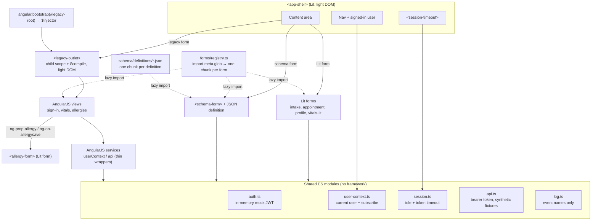

# angularjs-lit-coexistence-demo

**Live demo: https://getupworkdev.github.io/angularjs-lit-coexistence-demo/**

[](https://github.com/getupworkdev/angularjs-lit-coexistence-demo/actions/workflows/test.yml)
[](https://github.com/getupworkdev/angularjs-lit-coexistence-demo/actions/workflows/pages.yml)

A small demo of running **AngularJS 1.7** and **Lit** in the same page during an incremental migration. They share one shell, one set of services and one user, and swapping between them leaves nothing behind. It also includes a worked AngularJS → Lit form conversion, a JSON schema-driven form renderer, and the front-end practices a healthcare app needs.

Stack: Vite, TypeScript, Lit 3, AngularJS 1.7.9, Playwright.

> Demo only. The "patients", allergies, medications and users are invented. There is no real patient data anywhere in this repo.

---

## Architecture



| Piece | File | Notes |
| --- | --- | --- |
| Shell | `src/shell/app-shell.ts` | Lit, rendered to light DOM. Hash routing: `#/forms/<id>`. Swapping forms replaces the content element, which is what triggers each framework's teardown. On sign-out or timeout it remounts the current form. |
| `<legacy-outlet>` | `src/shell/legacy-outlet.ts` | Takes the existing `$injector` and a `{ template, controller }` view. Creates `$rootScope.$new()`, instantiates the controller via `$controller` (as `vm`) and `$compile`s the template into its own light DOM. In `disconnectedCallback` it calls `scope.$destroy()` and jqLite `empty()`, which removes the nodes and jqLite's listeners and data. |
| Lit form inside AngularJS | `src/forms/allergies/`, `src/components/allergy-form.ts` | The AngularJS view lists allergies and hosts a Lit `<allergy-form>`. `ng-prop-allergy` passes in the allergy being edited (`null` = add). The form runs native validation, then emits `allergysave` or `allergycancel`. `ng-on-allergysave` hands the result to the controller, which writes the model with `$scope.$applyAsync`. |
| Shared services | `src/shared/` | `auth.ts` issues an unsigned JWT-shaped token for a fake user and keeps it in memory. `user-context.ts` holds the current user with `subscribe()`. `session.ts` runs the timeouts. `api.ts` attaches the bearer token and serves fixtures. `log.ts` is the only logger. Lit imports these directly. `src/legacy/module.ts` wraps them as `userContext` and `api` services and triggers `$applyAsync` when the user changes. |
| Lazy registry | `src/forms/registry.ts` | `import.meta.glob('./*/meta.ts', { eager: true })` builds the nav. `import.meta.glob('./*/*.form.ts')` loads each form on demand. Every `customElements.define` goes through `defineOnce()` in `src/shared/define.ts`, which checks `customElements.get` first. |
| Form-associated input | `src/components/fa-text-input.ts` | `static formAssociated` + `attachInternals()`. Value goes to `FormData`, validity is mirrored from a native `<input>`, and it supports reset and disable. The label and input share a shadow root, and hint and error text are linked with `aria-describedby`. Supports text, email, tel, number and date, plus custom error messages. |
| Conversion pair | `src/forms/vitals/` (AngularJS), `src/forms/vitals-lit/` (Lit) | One real form implemented twice. See [docs/CONVERSION_GUIDE.md](docs/CONVERSION_GUIDE.md). |
| Schema renderer | `src/schema/schema-form.ts`, `src/schema/schema.ts`, `src/schema/definitions/*.json` | One component that renders any form definition. See [Schema-driven forms](#schema-driven-forms). |

### Decisions worth calling out

- **Light DOM for legacy views.** AngularJS templates expect global CSS, `label for` across the page and `document` queries. Putting them in a shadow root breaks all three.
- **The same object on both sides.** The AngularJS services do not copy state. `userContext.user` is a getter over the shared module. The only AngularJS-specific part is one `subscribe(() => $rootScope.$applyAsync())`, so a change made from Lit reaches AngularJS bindings.
- **Why `$applyAsync` in the ng-on handler.** `ng-on-*` wraps the expression in `$apply` when no digest is running. If the event fires *during* a digest, for example when a component emits while `ng-prop-*` is setting its value, it runs the expression inline with no digest of its own. Scheduling the write with `$applyAsync` is correct in both cases and folds a burst of events into one digest.
- **Lowercase custom event names.** `ng-on-*` lowercases the attribute name, so a `camelCase` event would need the `ng-on-my_event` escape. `allergysave` and `allergycancel` avoid that.
- **Meta and form split.** The nav needs titles without loading any form. A tiny eagerly-globbed `meta.ts` per form gives it that. The form file itself stays in its own chunk (`<id>.form-<hash>.js`).

---

## Converting AngularJS forms to Lit

[docs/CONVERSION_GUIDE.md](docs/CONVERSION_GUIDE.md) is a step-by-step playbook with a checklist:

1. Inventory the bindings.
2. Map validators to native constraints.
3. Replace `ng-model`.
4. Wire events and services.
5. Register the form in the lazy registry.
6. Add parity tests.
7. Remove the legacy form.

It uses one real form, implemented twice, as the worked example:

- **Original:** `src/forms/vitals/vitals.form.ts` (AngularJS).
- **Conversion:** `src/forms/vitals-lit/vitals-lit.form.ts` (Lit).
- **Parity tests:** `tests/conversion-parity.spec.ts` runs the same tests against both, located by role and label, with no per-framework branches.

---

## Schema-driven forms

`<schema-form>` renders a complete form from a JSON definition:

- **Sections** become `<fieldset>`/`<legend>` groups, in one or two columns.
- **Fields** can be text, email, tel, number, date, textarea, select, radio or checkbox. Each has a visible label, and optionally a hint and a custom error message.
- **Validation rules** (required, min/max, minLength/maxLength, step, pattern) become native constraints, so the browser enforces them.
- **Layout:** in a two-column section, fields can be `half` or `full` width.

On a valid submit it emits `schemasubmit` with typed values: numbers as numbers, checkboxes as booleans, empty fields as `null`. Definitions are checked before rendering. A broken one shows a list of problems rather than half a form.

```json
{
  "id": "patient-contact",
  "title": "Patient contact details",
  "sections": [
    {
      "title": "Identity",
      "columns": 2,
      "fields": [
        { "name": "givenName", "label": "Given name", "type": "text", "required": true, "width": "half" },
        { "name": "recordNumber", "label": "Synthetic record number", "type": "text", "required": true,
          "pattern": "SYN-[0-9]{4}", "message": "Use the format SYN-0000.", "width": "half" }
      ]
    }
  ]
}
```

Three examples live in `src/schema/definitions/`: `patient-contact.json`, `symptom-checklist.json` and `referral-request.json`. Open "Schema forms (JSON)" in the app to switch between them. Each definition is its own chunk, fetched when picked.

### From thousands of forms to one renderer

A large clinical system often has hundreds or thousands of forms: intake variants per clinic, questionnaires, assessments, referrals. Most of them are the same few building blocks in a different order. Hand-writing each one in AngularJS, and then again in Lit, multiplies migration cost by the number of forms.

With a renderer, the approach changes:

- **Convert the building blocks once, not every form.** Accessibility, validation, error display, logging and teardown live in one tested component. Fix a bug or an a11y issue there and every form gets it.
- **Forms become data.** Each form is a JSON file that can be reviewed, diffed, versioned and generated. A script can extract definitions from existing AngularJS templates, since `ng-model`, `ng-required`, `ng-pattern` and label text map directly onto the schema, leaving a human to check the output instead of rewriting markup.
- **Testing scales.** Renderer behaviour is tested once (`tests/schema.spec.ts`). Per-form tests become cheap checks: every definition passes `validateSchema`, renders, and passes axe. That loop can run over every file in the folder.
- **Shipping scales.** Each definition is a small lazy chunk, and adding a form means adding a JSON file, with no new component code.

It does not remove the long tail. Forms with bespoke logic, such as calculated scores, cross-field rules or conditional sections, need either schema extensions (`showIf`, computed fields, cross-field validators) or a hand-written Lit form like `vitals-lit`. The realistic target is that most forms are data and a minority are code.

---

## Healthcare front-end practices

Each practice below is implemented in the demo code and pinned by a test in `tests/practices.spec.ts`.

### The JWT is held in memory, never in `localStorage`

`src/shared/auth.ts` keeps the token in a module variable. Nothing is written to `localStorage`, `sessionStorage`, IndexedDB or a readable cookie, because Web Storage is readable by any script on the page and survives the tab. `getToken()` refuses an expired token. The trade-off is that a reload signs you out. A real app would restore the session from an httpOnly, SameSite refresh cookie that JavaScript can't read.

*Test:* after sign-in, Web Storage, cookies and IndexedDB are all empty, and a reload shows "Not signed in".

### No form data in logs or the console

`src/shared/log.ts` is the only logger. It accepts an event name plus a small metadata object (form id, field count, error class) and has no parameter for values or free text. Errors are logged by class name only, because messages often echo the input. AngularJS's `$exceptionHandler` is replaced so it goes through the same logger instead of dumping expressions to the console. Forms submit with `preventDefault()`, so values never land in the URL, and clinical inputs default to `autocomplete="off"` so the browser doesn't keep them in autofill history.

*Test:* sign in, then submit the intake, both vitals forms, an allergy and a schema form using distinctive values. At least 5 `form.submit` events must be logged, and none of the values may appear in any console message or the URL.

### Sensitive state is cleared on form swap

Swapping forms removes the form element. The Lit form's state goes with it, and the AngularJS view's scope is `$destroy`ed and its DOM deallocated. On sign-out or session timeout the shell also remounts the current form, so the next person at the workstation doesn't see what the last one typed.

*Tests:* a value typed into a Lit form and into an AngularJS form is gone after swapping away and back, and appears nowhere on the page, shadow roots included. Signing out clears the form on screen. The 500-swap leak test shows nothing is retained.

### Session timeout handling

`src/shared/session.ts` ends the session after 15 minutes without activity, or at the token's `exp` (60 minutes), whichever comes first. A minute before that, `<session-timeout>` opens a modal dialog with a countdown and "Stay signed in" / "Sign out now". Activity while the warning is showing doesn't extend the session: the person has to answer it. On expiry the user is signed out, the form is cleared, and a notice says why.

*Tests,* using Playwright's fake clock:

- The warning appears at 14 minutes idle, "Stay signed in" extends the session, and a second timeout signs out and clears the form.
- A click resets the idle timer.
- The token's `exp` ends the session even while the user is active.
- The dialog passes axe.

These are client-side courtesies for shared workstations. The server must still enforce token expiry and revocation, which this demo does not have.

---

## Run it

Requires Node 22 (see `.nvmrc`).

```sh
npm install
npm run dev          # http://localhost:5173
```

Tests run against the production build, where code splitting is real:

```sh
npx playwright install chromium   # once
npm test                           # vite build + playwright test
```

| Spec | What it checks |
| --- | --- |
| `tests/leaks.spec.ts` | Swaps forms 500 times (all eight, round-robin), then forces GC over the Chrome DevTools Protocol. AngularJS scope count, DOM event listener count (`Memory.getDOMCounters`) and shared-module subscriber count must all return to the baseline. Node count must be within a small margin. Also checks that leaving an AngularJS form destroys its scope tree. |
| `tests/a11y.spec.ts` | `@axe-core/playwright` with WCAG 2.0/2.1 A and AA plus 2.2 AA rules on the home page, every form, the intake form in its error state, the Lit form in edit mode, all three schema forms (blank and after a failed submit), and the session timeout dialog. Expects zero violations. |
| `tests/lazy-loading.spec.ts` | Records network requests. No form chunk loads on first paint, opening a form fetches exactly that form's chunk, and re-opening fetches nothing. |
| `tests/interop.spec.ts` | Signing in on the AngularJS side updates the Lit header and the reverse. For the Lit form hosted in AngularJS: edit data arrives via `ng-prop`; save, add and cancel come back via `ng-on` and update the AngularJS model; an invalid submit never reaches AngularJS. The form-associated input blocks submit, exposes its label and description, submits its value and resets. |
| `tests/conversion-parity.spec.ts` | The same four behaviours, run against the AngularJS vitals form and its Lit conversion: empty submit, range, step, and a valid submit. |
| `tests/schema.spec.ts` | Sections and labels, required, pattern, minLength and custom messages, typed output values, two-column layout, per-definition lazy loading, and rejection of a broken definition. |
| `tests/practices.spec.ts` | The healthcare practices above. |

**To see lazy loading yourself:** run `npm run build && npm run preview`, open DevTools → Network → JS, and click through the forms. Each `*.form-*.js` file appears only the first time its form is opened.

CI: `.github/workflows/test.yml` runs `npm test` on every push and pull request. When it passes on `main`, `.github/workflows/pages.yml` builds with the repo's base path and deploys to GitHub Pages. This needs **Settings → Pages → Source: GitHub Actions** enabled once.

---

## What this proves / what it does not

**This is a demo, not a production EHR. It uses no real patient data.** Every name, record number, allergy and medication is synthetic, and the "API" is an in-memory fixture.

### What it proves

- AngularJS views and Lit components can share one page, one shell and one set of services, with changes on either side visible on the other.
- An AngularJS view can be mounted and unmounted by a custom element, with no scope, DOM-listener or subscription leaks over 500 swaps in Chromium.
- A Lit form can live inside an AngularJS template, taking data through `ng-prop-*` and returning results through `ng-on-*`, with no wrapper directive.
- An AngularJS form can be converted to Lit with identical observable behaviour, shown by one test suite passing against both.
- One renderer can produce complete, accessible, validated forms from JSON, with each definition loaded lazily.
- Each form is a separate chunk that loads only when first opened. Adding a form is adding a folder, or a JSON file.
- The front-end practices above behave as described. Each is checked in a real browser, not just stated.

### What it does not prove

- **Clinical or regulatory fitness.** There are no clinical workflows, audit trail, consent capture, HIPAA safeguards, server-side validation or data retention rules. It is not an EHR and must not be treated as one.
- **Real authentication or session security.** The JWT is unsigned (`alg: none`) and created in the browser. There is no server, no refresh token, no revocation, and the timeouts are client-side only.
- **That your AngularJS app migrates this easily.** Real apps use `$routeProvider`/ui-router, `$http` interceptors, global event buses, directives with `replace: true`, and third-party modules. None of that is modelled here.
- **That the schema covers your forms.** It has no conditional sections, calculated fields, cross-field rules, repeating groups or file uploads. Real form catalogues need some of these.
- **Full accessibility.** axe finds a subset of WCAG issues automatically. Screen-reader, keyboard-only and zoom testing still have to be done by people.
- **Leak-freedom in general.** The leak test covers these forms in Chromium. Leaks in other browsers, or from code paths these forms don't exercise, would not show up.
- **AngularJS security.** AngularJS is end-of-life (January 2022) and `npm audit` reports known issues in it. That is part of why you would migrate. It is not something this demo fixes.
