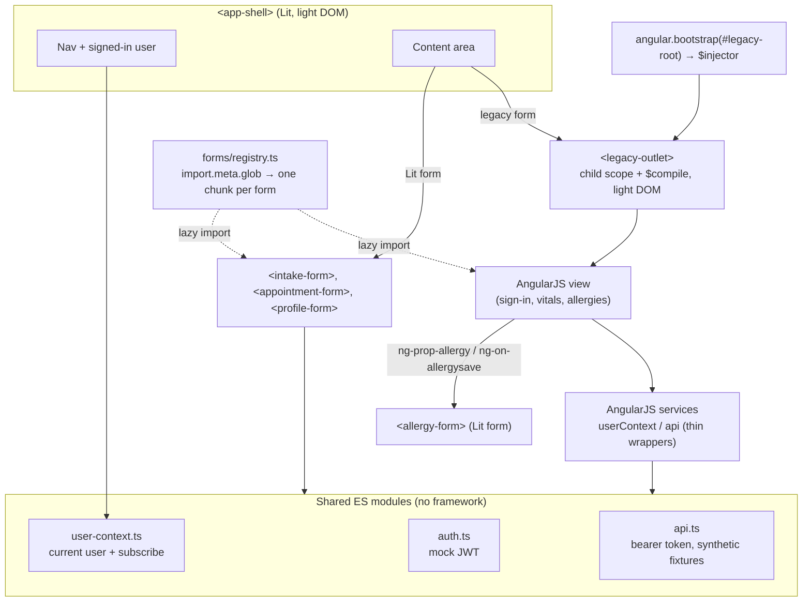

# angularjs-lit-coexistence-demo

[](https://github.com/getupworkdev/angularjs-lit-coexistence-demo/actions/workflows/test.yml)

A small demo of running **AngularJS 1.7** and **Lit** in the same page during an incremental migration. They share one shell, one set of services and one user, and swapping between them leaves nothing behind.

Stack: Vite, TypeScript, Lit 3, AngularJS 1.7.9, Playwright.

> Demo only. The "patients", allergies, medications and users are invented. There is no real patient data anywhere in this repo.

---

## Architecture



| Piece | File | Notes |
| --- | --- | --- |
| Shell | `src/shell/app-shell.ts` | Lit, rendered to light DOM. Hash routing: `#/forms/<id>`. Swapping forms replaces the content element, which is what triggers each framework's teardown. |
| `<legacy-outlet>` | `src/shell/legacy-outlet.ts` | Takes the existing `$injector` and a `{ template, controller }` view. Creates `$rootScope.$new()`, instantiates the controller via `$controller` (as `vm`) and `$compile`s the template into its own light DOM. In `disconnectedCallback` it calls `scope.$destroy()` and jqLite `empty()`, which removes the nodes and jqLite's listeners and data. |
| Lit form inside AngularJS | `src/forms/allergies/`, `src/components/allergy-form.ts` | The AngularJS view lists allergies and hosts a Lit `<allergy-form>`. `ng-prop-allergy` passes in the allergy being edited (`null` = add). The form runs native validation, then emits `allergysave` or `allergycancel`. `ng-on-allergysave` hands the result to the controller, which writes the model with `$scope.$applyAsync`. |
| Shared services | `src/shared/` | `auth.ts` issues an unsigned JWT-shaped token for a fake user. `user-context.ts` holds the current user with `subscribe()`. `api.ts` attaches the bearer token and serves fixtures. Lit imports these directly. `src/legacy/module.ts` wraps them as `userContext` and `api` services and triggers `$applyAsync` when the user changes. |
| Lazy registry | `src/forms/registry.ts` | `import.meta.glob('./*/meta.ts', { eager: true })` builds the nav. `import.meta.glob('./*/*.form.ts')` loads each form on demand. Every `customElements.define` goes through `defineOnce()` in `src/shared/define.ts`, which checks `customElements.get` first. |
| Form-associated input | `src/components/fa-text-input.ts` | `static formAssociated` + `attachInternals()`. Value goes to `FormData`, validity is mirrored from a native `<input>`, and it supports reset and disable. The label and input share a shadow root, and hint and error text are linked with `aria-describedby`. |

### Decisions worth calling out

- **Light DOM for legacy views.** AngularJS templates expect global CSS, `label for` across the page and `document` queries. Putting them in a shadow root breaks all three.
- **The same object on both sides.** The AngularJS services do not copy state. `userContext.user` is a getter over the shared module. The only AngularJS-specific part is one `subscribe(() => $rootScope.$applyAsync())`, so a change made from Lit reaches AngularJS bindings.
- **Why `$applyAsync` in the ng-on handler.** `ng-on-*` wraps the expression in `$apply` when no digest is running. If the event fires *during* a digest, for example when a component emits while `ng-prop-*` is setting its value, it runs the expression inline with no digest of its own. Scheduling the write with `$applyAsync` is correct in both cases and folds a burst of events into one digest.
- **Lowercase custom event names.** `ng-on-*` lowercases the attribute name, so a `camelCase` event would need the `ng-on-my_event` escape. `allergysave` and `allergycancel` avoid that.
- **Meta and form split.** The nav needs titles without loading any form. A tiny eagerly-globbed `meta.ts` per form gives it that. The form file itself stays in its own chunk (`<id>.form-<hash>.js`).

---

## Run it

Requires Node 22 (see `.nvmrc`).

```sh
npm install
npm run dev          # http://localhost:5173
```

Tests run against the production build, where code splitting is real:

```sh
npx playwright install chromium   # once
npm test                           # vite build + playwright test
```

| Spec | What it checks |
| --- | --- |
| `tests/leaks.spec.ts` | Swaps forms 500 times (all six, round-robin), then forces GC over the Chrome DevTools Protocol. AngularJS scope count, DOM event listener count (`Memory.getDOMCounters`) and shared-module subscriber count must all return to the baseline. Node count must be within a small margin. Also checks that leaving an AngularJS form destroys its scope tree. |
| `tests/a11y.spec.ts` | `@axe-core/playwright` with WCAG 2.0/2.1 A and AA plus 2.2 AA rules on the home page, every form, the intake form in its error state, and the allergies view with the Lit form in edit mode. Expects zero violations. |
| `tests/lazy-loading.spec.ts` | Records network requests. No form chunk loads on first paint, opening a form fetches exactly that form's chunk, and re-opening fetches nothing. |
| `tests/interop.spec.ts` | Signing in on the AngularJS side updates the Lit header and the reverse. For the Lit form hosted in AngularJS: edit data arrives via `ng-prop`; save, add and cancel come back via `ng-on` and update the AngularJS model; an invalid submit never reaches AngularJS. The form-associated input blocks submit, exposes its label and description, submits its value and resets. |

**To see lazy loading yourself:** run `npm run build && npm run preview`, open DevTools → Network → JS, and click through the forms. Each `*.form-*.js` file appears only the first time its form is opened.

CI (`.github/workflows/test.yml`) runs the same `npm test` on every push and pull request.

---

## What this proves / what it does not

**This is a demo, not a production EHR. It uses no real patient data.** Every name, record number, allergy and medication is synthetic, and the "API" is an in-memory fixture.

### What it proves

- AngularJS views and Lit components can share one page, one shell and one set of services, with changes on either side visible on the other.
- An AngularJS view can be mounted and unmounted by a custom element, with no scope, DOM-listener or subscription leaks over 500 swaps in Chromium.
- A Lit form can live inside an AngularJS template, taking data through `ng-prop-*` and returning results through `ng-on-*`, with no wrapper directive.
- Each form is a separate chunk that loads only when first opened. Adding a form is adding a folder.
- A form-associated custom element can take part in native form validation and pass automated WCAG A/AA checks.

### What it does not prove

- **Clinical or regulatory fitness.** There are no clinical workflows, audit trail, consent, HIPAA safeguards or data handling. It is not an EHR and must not be treated as one.
- **Real authentication.** The JWT is unsigned (`alg: none`) and created in the browser. Nothing verifies it.
- **That your AngularJS app migrates this easily.** Real apps use `$routeProvider`/ui-router, `$http` interceptors, global event buses, directives with `replace: true`, and third-party modules. None of that is modelled here.
- **Full accessibility.** axe finds a subset of WCAG issues automatically. Screen-reader, keyboard-only and zoom testing still have to be done by people.
- **Leak-freedom in general.** The leak test covers these six forms in Chromium. Leaks in other browsers, or from code paths these forms don't exercise, would not show up.
- **AngularJS security.** AngularJS is end-of-life (January 2022) and `npm audit` reports known issues in it. That is part of why you would migrate. It is not something this demo fixes.
